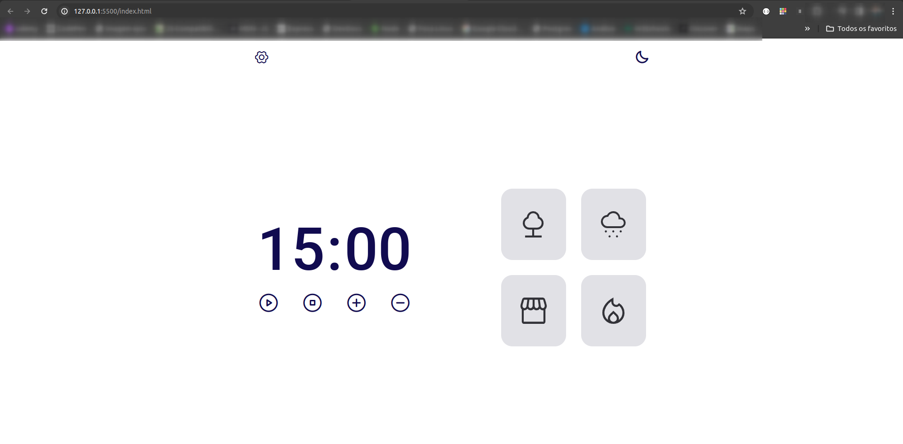
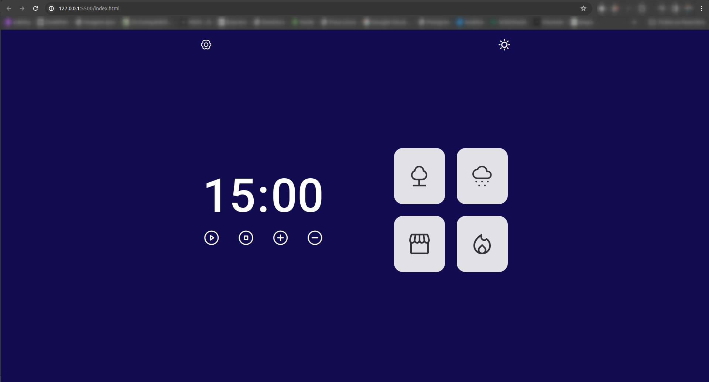
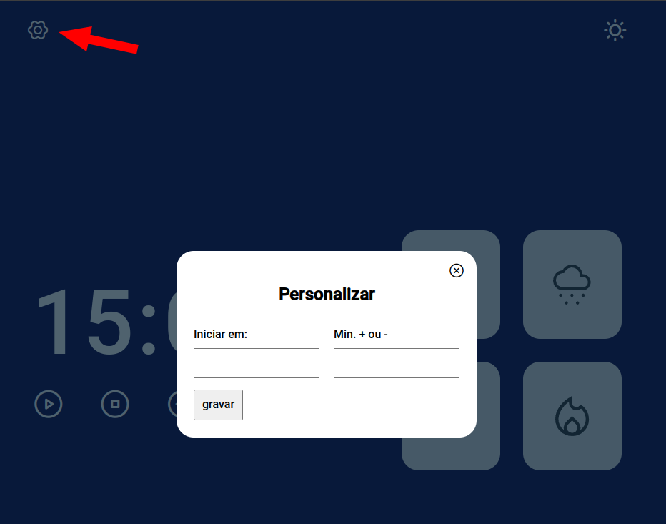
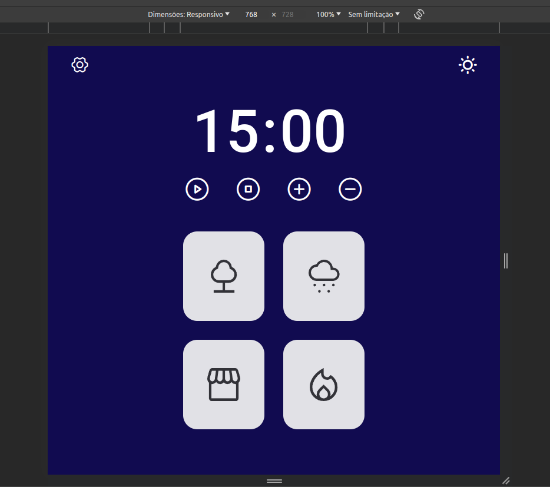
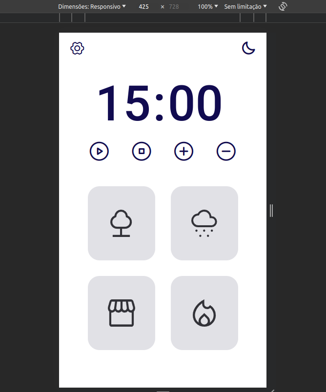
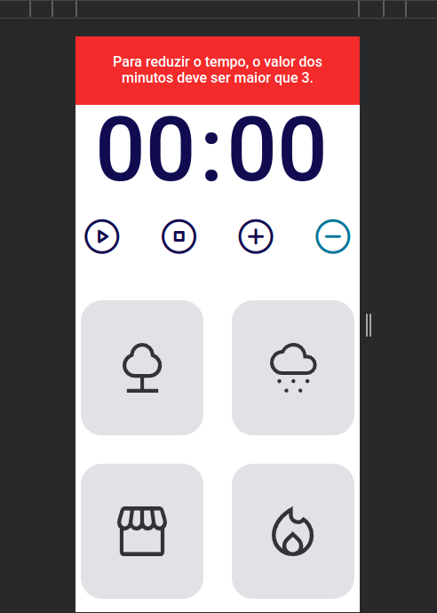
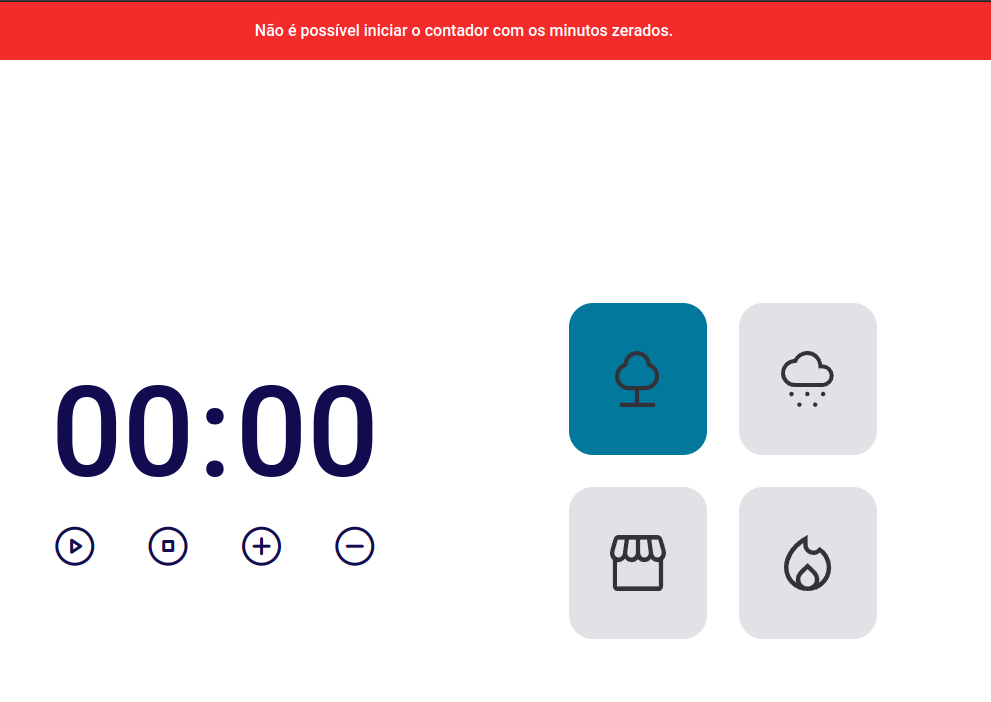
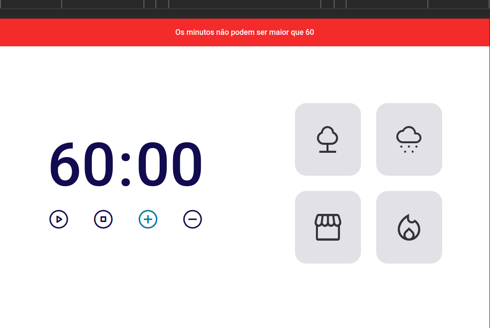
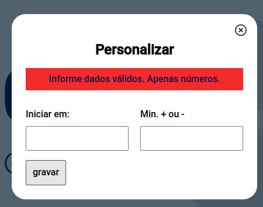

# Focus Timer V2 

Aplicação ideal para utilizar quando estiver estudando, além de contabilizar um determinado período de tempo, possui opções para inserção de sons que irão auxiliar na concentração e foco do usuário. 

Clique <a target="_blank" href="https://focus-timer-v2.netlify.app/">aqui</a> para testar a aplicação. 

Página inicial do projeto:

  

Página no modo dark:

  

Contém uma opção de configuração onde é possível personalizar o contador, indicando os minutos que o contador deve iniciar e quantos minutos devem ser adicionados ou removidos ao clicar nos botões de mais e menos:

  

Opções de layouts responsivos para dispositivos de telas menores:

  

  

Inseri algumas validações relacionadas ao comportamento da aplicação:

  

  

  

  

Esse projeto foi desenvolvido com as seguintes tecnologias:

- HTML e CSS
- JavaScript
- Git e Github
- Figma

Minhas redes:

<a target="_blank" href="https://codepen.io/jean_88asl/full/jOJbLOK"> <i class="ph-smiley"></i></a>
